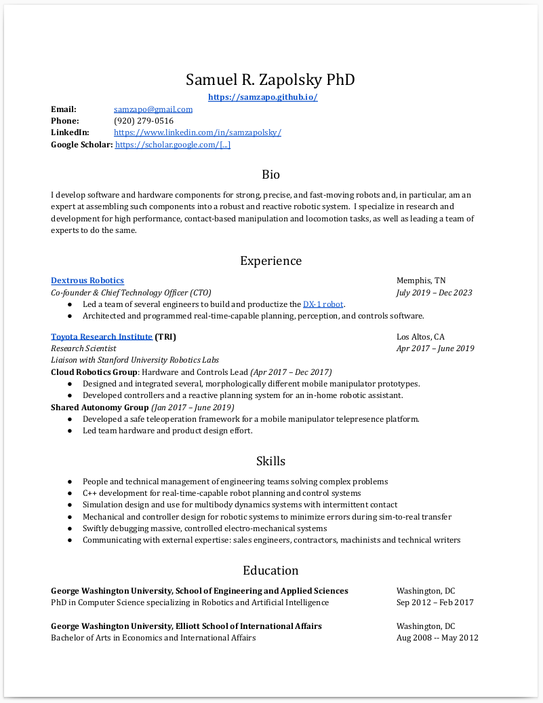

# Samuel Zapolsky Ph.D.

# Bio

_I am an expert in_ developing software and hardware components for strong, precise, and fast-moving robots and, in particular, assembling such components into a robust and reactive robotic system. _I specialize in_ researching and developing software for high performance, contact-based manipulation and locomotion tasks, as well as leading a team of experts to do the same. _I was previously_ Co-founder and Chief Technology Officer at Silicon Valley-funded startup Dextrous Robotics, where I developed innovative robotics hardware and software for use in the logistics space, specifically for package handling. My team deployed robust software and hardware components to the field for strong, precise, and fast-moving robotic systems often only seen in advanced research labs. _I hold a Ph.D. in Computer Science_ focusing on Robotics and A.I. from The George Washington University in Washington, DC.

### [My Publications & Patents (via Google Scholar)](https://scholar.google.com/citations?hl=en&user=646TcqgAAAAJ&view_op=list_works)

# Résumé

# Work history

## [**Dextrous Robotics**](https://dextrousrobotics.com)
CTO & Co-founder  
June 2019 - Dec 2023  
Memphis, TN

I was Chief Technology Officer (CTO) and Co-founder of Dextrous Robotics, where I and a team of highly skilled engineers develop cutting-edge robotics hardware and software for use in the logistics space, specifically for package handling.  My team has deployed to the field robust software and hardware components for strong, precise, and fast-moving robotic systems often only seen in advanced research labs. 

[Dextrous Robotics Homepage](https://www.dextrousrobotics.com/)

At Dextrous Robotics, we use high-performance robots to manipulate parcels by touch.  Our robots move heavy objects at remarkable speeds with unparalleled grace.  What sets our engineering team apart is our mastery of contact-based bimanual manipulation.  We pride ourselves on being among the world's leading experts in developing and implementing these sophisticated systems that put our robots into a league of their own.

## [**Toyota Research Institute**](http://www.tri.global/)
Research Scientist  
April 2017 – June 2019  
Los Altos, CA

## [**Positronics Lab**](https://PositronicsLab.github.io)
George Washington University  
Ph.D. Candidate  
September 2012 – February 2017  
Washington, DC  
Advisor: [Evan Drumwright](http://edrumwri.github.io/)

## [**Dynamic Legged Systems Lab**](https://www.iit.it/en/advr-labs/dynamic-legged-systems.html)
[Italian Institute of Technology: Department of Advanced Robotics](https://www.iit.it/research/lines/advanced-robotics)

Visiting Researcher  
July 2012 – Sep 2012  
Genoa, Italy  
Mentors: Jonas Buchli & Claudio Semini

# Contact Info

Email: [samzapo[at]gmail.com](mailto:samzapo+github@gmail.com)  
[LinkedIn](https://www.linkedin.com/in/samzapolsky)

# Ph.D. Research

I earned my Ph. D. while studying robotics in [Evan Drumwright](https://edrumwri.github.io/)’s [**Positronics Lab**](https://PositronicsLab.github.io) at GWU.  

My [dissertation](http://positronicslab.github.io/assets/pdfs/Z17.pdf) focused on discovering what circumstances make robots fail and then using simulted tools to modify a robot or its control system to prevent those failures from happening in the future, leading to a better and more robust robots.

**[Ph.D. Research at-a-glance](http://positronicslab.github.io/blog/robot-demos/)**

[Inverse Dynamics with Contact Force Prediction](http://positronicslab.github.io/blog/inverse-dynamics/)

[Adaptive Integration for Controlling Speed vs. Accuracy in Multi-Rigid Body Simulation](http://positronicslab.github.io/blog/adaptive-integration/)

[High-level Quadruped Control (Joystick)](http://positronicslab.github.io/blog/joystick-quadruped-control/)

[Running with a simulated quadruped](http://positronicslab.github.io/blog/running-quadruped/)
